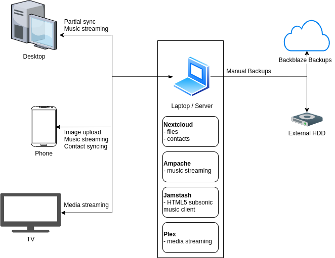

Local cloud might be a bit of an oxymoron, but it's not a bad way to describe what's going on here. Perhaps a more accurate phrase would be: self-hosted media server with backups and the ability to sync contacts and calendars and whatever else I decide to put on there. But that's a bit wordy.

Inspired by [this post by Marko Zivanovic](https://www.markozivanovic.com/screw-it-ill-host-it-myself/), I decided to set up my own version.

_Updated on August 7, 2021._

# Motivation / Goals

Previously, I had basically nothing. Important documents, treasured images, and my music library were spread out on different devices, with no security and only one backup to an external HDD. This is not a safe setup, especially since the HDD is already quite old.

So, my first goal was to achieve some sort of data security, like by following the [3-2-1 rule](https://en.wikipedia.org/wiki/Backup#Storage) (3 copies of the data, on 2 different types of storage, with 1 copy offsite).

My second goal was to have a convenient solution for listening to music, and syncing or giving access to my library across different devices. Not sure how much of an oddity this is, but I never got into music streaming (e.g. Spotify, Apple Music) due to both issues of artist compensation and not actually owning the music. Even though I spend more money, I listen to music so much I feel it's worth it.

My third goal was to stream videos to my TV. 

My fourth goal was to do all this on my old laptop so that I don't have to pay much money (as opposed to buying a Synology device or similar).

# Setup

Note that this is a local access setup only. I have no way to access this from the outside world. If I were to set up remote access, I would either be very sure I had no vulnerabilities, or set up a VPN (e.g. [Wireguard](https://www.wireguard.com/)).

## Data

My first priority was data, and [Nextcloud](http://nextcloud.com/) is pretty great for this. From the desktop client, I can easily set up real-time sync for whichever folders I want. I don't sync everything to my desktop, since I don't want to bloat my SSD, but it's nice to have important documents and images real-time synced to something that isn't an HDD.

For my cell phone, the Nextcloud app let's you automatically upload photos, which is nice. I also sync contacts from Nextcloud.

For backups, I manually back everything to a 1TB external HDD, and also manually backup to [Backblaze](https://www.backblaze.com/) (storage is cheap at $0.005 / GB / month). Some might want automatic backups, but I prefer the manual process.

## Music

Nextcloud has a [music app](https://apps.nextcloud.com/apps/music) you can activate. However, I found that it didn't pick up certain albums in my library, so I decided to try alternatives, and eventually landed on running [Ampache](https://ampache.org/). The Nextcloud music plugin actually runs an Ampache backend for its streaming API, so I was able to use the same applications I had been testing out with Nextcloud music.

Ampache was able to import all my music library, but had some trouble finding album cover art and split some albums into multiple albums. 

For the cover art, it for some reason found art with a very small resolution (like 20x20 pixels), which looked horrible on any interface. Not sure if there was an easier way around this, but I ended up manually finding about 150 cover art images, and placing them in my music library (Ampache will pick up art placed in the directory - by default it looks for images with the same name as the folder). 

The album splits were, in the end, mainly due to different expectations in tagging. For whatever reason, I had albums where the `year` tag was set differently for different songs (e.g. `Best of` albums had the `year` set as the original release year of that particular song). However, Ampache expects this tag to be the same for the whole album, and to be the year that the _album_ was released. 

To fix this, and some other tagging problems (not properly recognizing some albums), I used [beets](https://beets.io/) music tagger. This took a while, and I still had to manually fix some remaining issues, but definitely a good way to tag your music.

After all that, Ampache had my library properly, but I needed a way to play it. Ampache has it's own API, and also supports Subsonic, and several other ways of streaming media.

I haven't found a desktop client that I really like. I'm spread out across Mac, Windows, and Linux, but all of the clients I've looked at are either not great or no longer maintained or both. Eventually I've settled on using (and self-hosting!) [Jamstash](https://github.com/tsquillario/Jamstash), which is an HTML5 Subsonic client that I like slightly better than Ampache's own web client. You can download music from Jamstash, but it doesn't offer a nice way to play downloaded music. My biggest gripe is that sometimes while streaming there is quite a gap of time between songs, but this could be due to my rather old laptop. However, it does a decent job, and I like the random album feature.

For iOS, I've been trying out both play:Sub and Amperfy, and haven't yet chosen between them, although play:Sub does cost a small amount. Both allow you to download music to the cache, which is essential for me.

_August 7, 2021 update_: I've been exclusively using play:Sub. It does the job, but is a bit janky in a couple ways (rarely shows album art, UI is clunky, etc).

## Videos

My only requirement here was to be able to stream videos to my TV. I had hoped to use [Jellyfin](https://jellyfin.org/), but unfortunately there is no client for my TV (Samsung has it's own OS called Tizen), although it is coming soon. You can see the repo for [jellyfin-tizen here](https://github.com/jellyfin/jellyfin-tizen). I tried manually installing it, but didn't manage to connect the TV to my computer and gave up pretty quickly.

Until I retry or the official version is released, I'm using [Plex](https://www.plex.tv/). 

My other option (which sounds very attractive) is to ditch the Samsung smart TV and power a dumb TV with a Raspberry Pi, or something similar.

_August 7, 2021 update_: After giving away the Samsung TV, I'm now using Jellyfin to stream videos to an iPad. Mostly it works fine, although sometimes the video freezes. Not sure if I'll get another TV in the future.

## Laptop

Running all this is my old (~2013) MSI laptop. It has a 128 GB SSD and a 1 TB HDD, which is where all the data is kept. I installed ubuntu server, removed the battery, and plugged it in next to my router. It's fairly quiet, and does the job. I have yet to check my power usage.