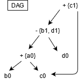
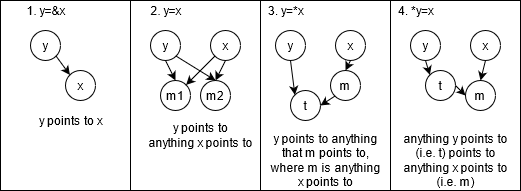
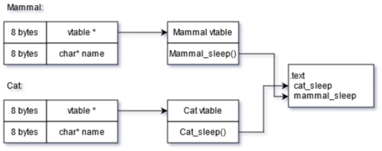
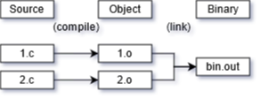

This is part 5 of [my notes](/computers/compilers) from the University of Toronto course CSC467: Compilers. This section covers semantic analysis.

Find [part 4 (optimization) here](/computers/compilers/optimization).

Key concepts of code generation:

- Instruction Selection
- Register Allocation
- Machine Dependent Optimization
- Runtime Environment
- Dynamic Memory Management
- Linking

---

# Target Machine and Assembly

Note: our target machine:
- byte-addressable memory
- n general purpose registers (R0 ... Rn-1)
- program counter: PC, stack counter SP, stack base BP

Note: our target assembly (where loc can be register, memory address, or immediate value):
- LD reg, loc
- ST addr, reg
- BR L1
- BLTZ r, L1
- OP dreg, loc1, loc2

E.g.
```C
//TAC IR
x=y+z

//Assembly
LD R0, y
LD R1, z
ADD R0, R0, R1
ST x, R0
```

E.g.
```C
//TAC IR
if (x<y) goto L;

//Assembly
LD R0, x
LD R1, y
SUB R0, R0, R1
BLTZ R0, L
```

# Instruction Selection

First we convert our TAC to a DAG.

- there is a node for each initial value of variables
- there is a node for each statement in a block
  - name is operator, label is assigned variable
  - children are (last definition) of operands

E.g.
```C
//TAC IR
a = b+c
b = a-d
c = b+c
d = a-d
```


Then we need to generate assembly from the DAG. This is represented as 'tiling' the DAG (we only discuss tree-tiling, which assumes the DAG is a tree).

## Register Allocation

The compiler is responsible for moving data between memory and registers. IR has unlimited variables, but hardware has limited registers. We need to assign variables to registers in an intelligent way using Register Allocation.

- *naive* - load then store before/after each operation. This is simple, and uses a minimal number of registers, but has bad performance.
- *ideal* - reuse registers. At each point, one register holds one live variable.

### Linear Scan Register Allocation

Assign registers to variable based on liveness:
- do scan from start to finish
- live range begins -> give variable free regsiter
- live range ends -> register is freed
- if the live range is not continuous, make it continuous (fill in gaps)

If you run out of registers:
- evict to memory the variable that ends its live range the earliest
- to access an evicted register:
  - backup a register Ri to memory location M
  - load evicted variable into Ri
  - operate on variable and backup to memory location M
  - restore register Ri from memory location M

### Graph Coloring

This is slower than linear scan, but the result is better.

Basically, if you have 2 variables that are live at the same time, they cannot share a register.

Construct an undirected graph (Register Inference Graph):
- node is temporary variable
- edge between a, b if they live at the same point
- two nodes not connected => they can be allocated to same register

Graph coloring assigns colors to nodes such that the nodes connected by an edge have different colors. A graph is k-colorable if it can be colored with k colors. E.g. a triangle is 3 colorable but not 2 colorable.

In our case, instead of using colors we use registers.

Graph coloring is NP-hard if there are >3 registers, but we can use heuristics to get a pretty good solution.

Chaitin's Algorithm:
1. Pick a node t that has less than k neighbours
2. Put t on stack and remove from RIG
3. Repeat until only one node left - color it
4. Pop and color one node from the stack, until the stack is empty

# Machine Dependent Optimization

Exploit a specific machine's dependent properties. This is a critical step, but is messy, with different techniques for different machines.

## Pipeline Scheduling

Many architectures pipeline instructions to increase effective speed. To allow for pipelining, we should avoid data dependencies:
- RAW (read after write)
- WAR (write after read)
- WAW (write after write)

The solution is to reorder instructions to increase performance. We can do this with a data dependency DAG. The optimal scheduling is another NP-hard problem, but these are 2 heuristics we can use:
1. Schedule instructions that can complete earlier.
2. Schedule instructions that have more dependents.

## VLIW (very long instruction word)

VLIW supports multiple functional units for one instruction. This lets the compiler combine instructions to execute them in parallel.

## Cache-Oriented Optimization

CPU cache is designed to be transparent to program and compiler, but we can still optimize for cache behavior.

The cache uses temporal (likely to read same object more than once) and spatial (nearby objects) locality. Most cache systems load recently used memory and nearby data into the cache automatically. The compiler can reorder code to try and take advantage of this. 

E.g. loop reordering reorders for-loop data accessing to take advantage of spatial locality.

## Aliasing Analysis

This is for when two expressions denote the same memory location (e.g. pointers, indexing into an array). Our goal is to statically identify alising relations between variables, which is good for common sub-expression elimination (with pointers) and constant propogation (with pointers).

### Anderson-style pointer Analysis

This generates constraints for pointer instructions.
1. `y=&x => x ϵ pt(y)`
2. `y=x  => pt(y) ⊇ pt(x)`
3. `y=*x => ∀m ϵ pt(x), pt(y) ⊇ pt(m)`
4. `*y=x => ∀n ϵ pt(y), pt(n) ⊇ pt(x)`



e.g.
```C
p=&a // ptr | pt()
q=&b // ----------
*p=q //  p  |  q
r=&c //  q  |  b
s=p  //  a  | b,c
t=*p //  r  |  c
*s=r //  s  |  a
     //  t  | b,c
```

# Runtime Environment

Code generation needs to convert high-level structure into low-level physical machine operations. 
- High level: functions, variables, objects, closures.
- Low level: arithmetic ops, memory ops, register ops, control jumps.

The runtime environment is a set of data structures used at runtime to implement high-level structures. E.g. stack, heap, static data, virtual function tables.

When you run a process, it makes some syscalls (fork, execv), then reads the file's first 512 bytes into memory (does some sanity checks). Then you setup the new address space and jump to the code entry point.

## Memory

```
Address Space

 -------------  47 bit
|    stack    |
|             |
|-------------|
|      |      |
|      v      |
|             |
|      ^      |
|      |      |
|-------------|
|     heap    |
|-------------|
|     .bss    |
|-------------|
|    .data    |
|-------------|
|     .txt    |
 -------------  0 bit (0x0)
```

Defining the sections:

- stack is local variables, grows downwards.
- heap is dynamically allocated variables, grows upwards.
- .bss is zero initialized static variables. Use .bss segment to make executable files smaller.
- .data is non-zero initialized static variables.
- .text is binary code.

Some notes:

- Global variables are static by default.
- All static variables are default set to zero (can be set one time).
- C doesn't default initialize local variables due to increased cost of function calls.

### Array Representation

```
C-style
-----------------------
| A[0] | ... | A[n-1] |
-----------------------

Multi-dimensional
-----------------------------------------
| A[0][0] | A[0][1] | A[1][0] | A[1][1] |
-----------------------------------------

Java
---------------------------
| n | A[0] | ... | A[n-1] |
---------------------------
```

Note that Java stores the length of the array at the start, where C doesn't.

### Alignment

Variable addresses are self-aligned. This means the alignment depends on the size of the variable. E.g. `int*` is 8-bytes aligned, `short` is 2-bytes aligned.

- 1-byte alignment: any address is ok.
- 2-byte alignment: only addresses divisible by 2 are ok (i.e. last bit is zero).
- 4-byte alignment: only addresses divisible by 4 are ok (i.e. last 2 bits zero).
- ...
- n-byte alignment: only addresses divisible by n are ok (i.e. last log2(n) bits zero, where n is divisible by 2).

The size of a `struct` is aligned to the widest scalar member. E.g. (on a 64-bit machine):

```C
struct foo {
    char c; //1 byte + 7 bytes pad
    char *p; //8 bytes for an address
    int x; //4 bytes
    //4 bytes padding to align w/ 8-byte alignment
}; //sizeof foo is 24 bytes
```

You can reorder the struct to be `char`, `int`, `char*` to save space (total would be 16 bytes).

Another example:

```C
struct foo2 {
    short s; //2 bytes
    char c; //1 byte
    //1 byte pad
}; //sizeof foo2 is 8 bytes
```

## Functions

Function calls use stack frame and activation record. The stack contains function arguments, return address, caller frame address, and local variables. When you call a function, put a new stack frame on the stack. When you return, pop the current frame.

```C
1: int foo(int x, int y) { // ---------------- <- stack top
2:     int z = x + y;      // | Frame main() |
3:     return z;           // |--------------|
4: }                       // |      1       | (first arg)
5: int main(void) {        // |--------------|
6:     foo(1,2);           // |      2       | (second arg)
7:     return 0;           // |--------------|
8: }                       // |    main:6    | (return)
                           // |--------------|
                           // |     rbp      |
                           // |--------------|
                           // |     z=3      | <- rbp (base of stack frame)
                           // |--------------|
                           // |              | <- rsp (top of stack)
                           // |     ...      |       (stack grows down)
```

Notes:
- return done through return register
- argument evaluation order is unspecified (implementation-dependent)

### Closure in C

Not sure why this is relevant, but it was in my notes.

```C
typedef struct closure {
    int i;
    int (*call)(struct closure *env);
} closure;

int call(closure *env) {
    env->i++;
    return env->i;
}

closure create() {
    closure c = {.i=0, .call=call};
    return c;
}

closure f1 = create();
printf("%d\n", f1.call(&f1));
printf("%d\n", f1.call(&f1));
```

Output:
```
1
2
```

## Encoding Objects in OOP

Without methods, it is the same as struct aligning. Derived fields follow fields of base classes.

With member functions:
- on function call need to know: which object are we calling? which function are we calling?
- to know the object: pass pointer `this` implicitly to each function.
- to know which function: static dispatch (call function based on static type of object) vs dynamic dispath (runtime polymorphism; call function based on runtime type using virtual function table).

### vtable (Virtual Function Table)

A vtable is an array of pointers to member function implementations. To invoke a function, statically determine the offset of function pointer in the vtable, then follow the pointer and invoke.

- memory cost: vtable pointer for each object, vtable for each class.
- time cost: each virtual function call needs to visit vtable pointer, dereference the vtable, index into the vtable, and follow the pointer.

E.g.



# Runtime Memory Management and Garbage Collection

Problem: how to deal with memory?

### Solution 1: Manual Memory Management

Developer handles memory with malloc/new and free/delete.

Pros:
- implemented as library (no need for language runtime)
- programmer can make aggressive optimizations

Cons:
- easily leads to troublesome bugs (memory leak, use-after-free, double free)
- errors can escape compiler checks but bad at runtime

### Solution 2: C++ unique_ptr (or Rust)

One memory object can obe reference by only one pointer at a time (the owner). This disallows aliasing (pointer copying) but allows object moving. Memory gets deallocated when the owner goes out of scope. However, this has it's limitations (even Rust allows direct pointer access with the `unsafe` keyword).

### Solution 3: Reference Counting

Store a refcount tracking the number of references to an object. When it hits zero, deallocate it.

Pros:
- avoids troublesome bugs

Cons:
- slower assignment
- can't deal with reference cycles (mitigate with weak_ptr that doesn't affect refcount)

## Garbage Collection (GC)

Reference counting is imprecise (due to reference cycles) - a better solution is reference _tracking_. An object that won't be used is garbage and can be freed.

An object is reachable iff:
- register or named memory location points to it (root set)
- another reachable object points to it

A nonreachable object is garbage.

### Mark-and-Sweep GC

Algorithm:
- _Mark_ reachable objects
  - add root set to work queue
  - while queue not empty
    - dequeue one object x
    - if x not marked, marked and enqueue all objects reachable by x
- _Sweep_: reclaim memory
  - for each object
    - unmarked -> free
    - marked -> unmark

Problems:
- the runtime of GC is proportional to the number of allocated objects
- work queue needs memory
  - what if you run out of memory during GC? (terrible things)

### Baker's Algorithm

Augment each object with a status: Marked, Enqueued, or Unknown.

Maintain doubly-linked lists of all objects (i.e. have 3 lists, one for each state).

- Move all objects pointed to by root set to Enqueue
- While Enqueue not empty, dequeue object o
  - move o to Marked
  - move objects pointed to by o to Enqueue
- Objects in Unknown -> reclaim
- Move all from Marked -> Unknown

### Summary of Mark-And-Sweep

Pros:
- finds exactly reachable objects
- doesn't change addresses of reachable objects

Cons:
- stop-the-world -> large pauses
- linked-list / state info uses lots of memory per object in Baker's Algorithm

# Linking

Algorithm:
- each object defines _import_ and _export_ symbols
- linker maintains exported list, undefined list
- linkers encounters new object, goes over its symbol list
  - for each export e: if e already in exported list report error, else add to exported (remove from undefined if there)
  - for each import i: if i exists in exported, do nothing, else add i to undefined
  - after scanning each, if undefined list not empty, error

