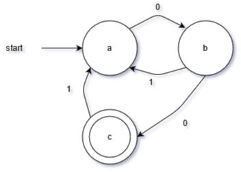
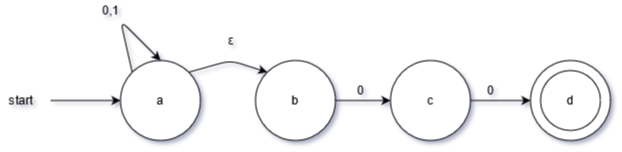
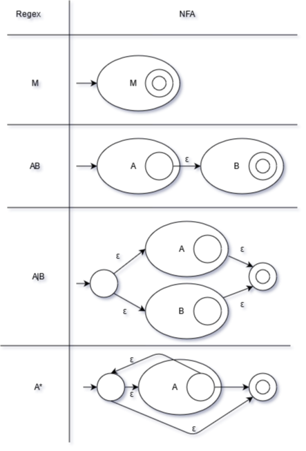

This is part 1 of my notes from the University of Toronto course CSC467: Compilers. This section covers Lexical Analysis, or Tokenizing.

Find [part 2 here](/computers/compilers_part_2).

The first process that occurs in any compiler is lexical analysis, or partitioning the program into tokens. In general, a token object has:
- token type
- pattern
- matching substring
- attributes (value, line #)

For example:

**Identifiers**, or variable names, are non-keyword strings that start with a letter. Identifier is the token type, the pattern is defined by "non-keyword strings that start with a letter," the matching substring will be the identifier string itself, there will not be a value, and the line number will be the line of code where the identifier is located (line # is useful for outputting error messages).

**Integer literals** are simply digits, perhaps with a + or - in front. In this case, the value attribute will be the integer value (stored as an `int` in the compiler), as opposed to the matching substring (stored as a `string` in the compiler).

To define these patterns in a systematic way, we use _regular expressions_.

# Regex

A regular expression, or [regex](https://en.wikipedia.org/wiki/Regular_expression), is a systematic way to define search patterns.

[Relevant xkcd](https://xkcd.com/208/)

Quick cheat sheet:

```
A|B is union
!A is not
AB is concatenation
A{i} is iteration (A appearing i times)
A* is 0 or more
A+ is 1 or more
A? is 0 or 1 times
^A is head anchor
A$ is tail anchor
(A) is a group, and can be referred to later in the regex as \1 or $1
```

Some caveats: a regex cannot describe everything (e.g. there is no way to match every palindrome), and there are also [evil regex](https://stackoverflow.com/questions/12841970/how-can-i-recognize-an-evil-regex), where compute time can scale exponentially with input length (these occasionally cause high-profile [outages](https://stackstatus.net/post/147710624694/outage-postmortem-july-20-2016)).

# Finite Automata

Regexes are great, but we need a way to represent them in a computer. To do this we translate a regex into a finite automata. A finite automata is essentially a state machine, with a finite set of states (or nodes), and a bunch of transitions (or edges). There is one starting state, and one or more accepting states. Each transition is associated with an input, except for epsilon-transitions, which are free to take (don't consume input).

Two main types of finite automata:
1. **NFA or Non-deterministic Finite Automata.** Can have multiple transitions per input per state; can have epsilon-transitions. Can be in multiple states at one time. More compact, easier to generate. 
2. **DFA or Deterministic Finite Automata.** Only one transition per input per state; no epsilon-transitions. Can only be in one state at a time. Faster to execute.



E.g. DFA (above) and NFA (below) which both describe the regex (0|1)*00.



Note that a state is shown by a circle, a matching state is shown by two nested circles, and transitions are given by arrows.

# Regex to DFA

For compilers, we define patterns using a regex, which is used to generate an NFA, which gets used to generate a DFA, which finally generates a table that we can use to quickly check for matches.

Regex --> NFA --> DFA --> Table

1. For turning a regex to an NFA, there are a series of rules you can apply, which are summarized in the diagram below.



2. For turning an NFA to a DFA, you merge epsilon-closure states in the NFA (all states reachable by following only epsilon-transitions) into one DFA states. This usually results in more states.

3. To implement a DFA as a 2D table T: for each transition from state S_i to S_k using input token a, set T[i][a] = k. Then, given a state S_i and the next input a, you can easily find the next state S_k.

# Flex

[Flex](https://en.wikipedia.org/wiki/Flex_(lexical_analyser_generator)) is a lexical tool you can use to tokenize programs. Basically, you define a pattern (with a regex) and a rule action.

e.g. defining a float
```
DIGIT [0-9]
DIGIT+"."DIGIT* { printf("float: %f\n", atof(yytext)) }
```

Two important rules flex uses:
1. Longest match rule. If multiple rules match, take the rule that matches the most characters.
2. Priority rule. If 2 rules match with the same number of characters, take the rule listed first.

# Errors

Note that the only type of error we can detect at the lexical analysis stage are invalid tokens (e.g. `int 0ab;` is not a valid identifier in C). 