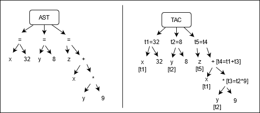

This is part 4 of [my notes](/computers/compilers) from the University of Toronto course CSC467: Compilers. This section covers semantic analysis.

Find [part 3 (semantics) here](/computers/compilers/semantic_analysis) and [part 5 (code generation) here](/computers/compilers/code_generation).

Key concepts of optimization:
- Intermediate Representation (IR)
- IR Optimization

---

# Intermediate Representation (IR)

IR is useful since it is language and machine independent. After transforming the language to IR, we can perform machine independent optimizations. Then, after or during code generation, we can perform machine depended optimization.

Some different IRs:
- LLVM - every variable is immutable
- JVM - stack based bytecode
- GCC - Three-Adress Code (TAC) - each instruction has one operator and at most 3 operands

Our focus will be on TAC.

## TAC

TAC is a high-level assembly, where we assume we can create infinite temporary variables.

E.g. C to TAC
```C
//C             //TAC
int x=32;       //int t1 = 32
int y=8;        //int t2 = 8
int z=x+y*9;    //int t3 = t2 * 9
                //int t4 = t1 + t3
                //int t5 = t4
```

### AST to TAC

From our AST (Abstract Syntax Tree) that is produced by semantic analysis, we can directly produce TAC. E.g.



Note that since we are in the same scope for this entire AST, the label `x` and `y` in different places refers to the same variable.

### AST to DAG to TAC

From our AST, we can create a DAG (directed acyclic graph) for a more compact representation, and a better TAC. In a graph, nodes can have more than one parent, which easily let's us reuse components, since we don't have to reuse nodes.

E.g. a + a * (b-c) + (b-c) * d


Below we can see the TAC for the two cases. The TAC from the DAG reuses the value of `b-c` to get rid of a variable.

```C
//same for both
int t1 = a;
int t2 = b;
int t3 = c;
int t4 = d;

//TAC from AST
{
    int t5=t2-t3; //b-c
    int t6=t1*t5; //a * (b-c)
    int t7=t2-t3; //b-c
    int t8=t4*t7; //d * (b-c)
    int t9=t8+t7; //a * (b-c) + d * (b-c)
    int t10=t1+t9; //a + a * (b-c) + d * (b-c)
}

//TAC from DAG
{
    int t5=t2-t3; //b-c
    int t6=t5*t4; //(b-c) * d
    int t7=t1*t5; //(b-c) * a
    int t8=t7+t6; //a * (b-c) + (b-c) * d
    int t9=t1*t8; //a + a * (b-c) + (b-c) * d
}
```

### Expressions to TAC

Dealing with specific expressions:
- _bools._ Represented as zero or nonzero ints. TAC has `!`, `<`, `&&`, `||`, `==` operators.
- _control flow_. TAC has `Goto Label` and `If value Goto Label`
- _functions._ Define a function like:
```
DefineFunc add
BeginFunc
t0=x+y
Return t0
EndFunc
```
- _function calls._ Call a function like:
```C
//z = func(1,2)
PushParam 1
PushParam 2
z = Call func
PopParams 2
```

# IR Optimization

There are a couple of things we can do to optimize at this stage. IR itself has some redundancies (reuse of intermediate results). The programmer's code can be optimized (eliminate dead code, inline functions). Note that any optimization must be semantic preserving, i.e. it must not alter observable behavior.

A **basic block** is a maximal sequence of IR instructions with:
- no labels (except at 1st instruction)
- no jumps (except at last instruction)

I.e. you can't jump to the middle of a basic block, and you can't jump out of a basic block. A basic block is a single-entry, single-exist, straight-line code segment.

A **control flow graph** (or CFG) is a directed graph of basic blocks within a function. Every node in the graph is a basic block, and edges show paths that execution can follow.

## Local Optimization

Local optimization works on a single basic block. Note that to reach an optimal state, we might have to apply optimization techniques multiple times.

### Common Subexpression Elimination

If we have:
```C
v1 = a op b
...
v2 = a op b
```

If values of `v1`, `a`, `b` are not modified, then we can rewrite the last expression as `v2 = v1`. This can help optimize since we don't need to repeat the calculation.

### Copy Propagation

If we have:
```C
v1 = v2
...
a = ...v1...
```

If values of `v1`, `v2` not modified, we can rewrite the last expression as `a = ...v2...`. This can help optimize is `v1` is made redundant (can remove the variable).

### Implementing Commone Subexpression and Copy Propagation

Both of the above depend on an analysis of _available expressions_. An expression is available if some variables in the program currently hold its value. We maintain a list of available expressions during analysis.

At the beginning, the list is empty. As we scan an expression `a = b op c`, remove anything containing `a` (previous value no longer available), and insert the new available expression as the tuple `(b op c, a)` (meaning the value of `b op c` is contained within `a`).

- Common expression elimination. Replace an available expression with the variable holding the value.
- Copy propagation. Replace a variable with an available expression.

### Dead Code Elimination

Eliminate all instructions that won't be used. To do this, compute a _live variable set_ on each instruction. A given variable is _live_ if it will be read before it is overwritten. We can compute the live set by walking backward in a basic block. Then, eliminate all instructions done on non-live variables.

### Other

- arithmetic simplification (e.g. rewrite `x=4*a` as `x=a<<2`)
- constant folding (e.g. rewrite `x=4*5` as `x=20`)

## Global Optimization

Global optimization works on the CFG of a function.

## Global Dead Code Elimination

This is similar to local dead code elimination, but we chance the liveness analysis from using an array to using a graph. The algorithm is listed below:
- each basic block b has sets `IN`, `OUT`
- set `IN[b]={}`, `IN[exit]=set of vars live on exit`
- for every basic block b of each possible execution path
  - `OUT[b]` is union of `IN[p]` for each successor `p`
  - `IN[b]` is result of local analysis within basic block b
- do this until all edges are covered an no changes occur (fixed-poitn iteration)

## Constant Propagation

Do this after constant folding at the expression level. Replace each variable known to be a constant with the constant. Note that something is a constant if it is known at compile time. 

Doing this locally is straightforward. For global, we have to track what value might be set. When execution paths meet, a variable is only constant if it is constant in both execution paths _and_ it is the same value.
- for each basic block b
  - `IN[b] = Merge(OUT[Prev[b]])`
  - `OUT[b] = LocalPropagate(b, IN[b])`
- until `IN[b]`, `OUT[b]` unchanged for all b

## Partial Redundancy Elimination

### Type 1: Global Common Sub-expression

E.g.
```C
if (cond) a=b+c;
else {b=7; d=b+c;}
e=b+c;
```

The CFG of the above would look like:


When we get to `B3`, the expression `b+c` is available in both paths (from `B2` it is in `a`, from `B3` it is in `d`). To make it usable, we add a variable `t`, so that the code becomes:
```C
if (cond) {t=b+c; a=t;}
else {b=7; t=b+c; d=t;}
e=t;
```

### Type 2: Loop Invariant Expression

Pretty simple - move an expression out of the loop if it is available. Basically, if the value won't change during loop iterations, then only compute it once.

### Type 3: Partially Redundant

If an expression is available in one path, we can still move it. E.g.
```C
if (cond) a=b+c;
e=b+c;
```

In the `if` path, `b+c` is already available. But in the `else` path, it isn't. We can make this into:
```C
if (cond) {t=b+c; a=t;}
else {t=b+c;}
e=t;
```

Note that this could further be optimized (with some sort of global common subexpression magic) to:
```C
t=b+c;
if (cond) a=t;
e=t;
```