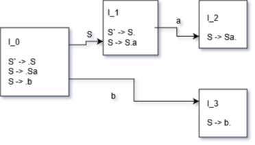

This is part 2 of my notes from the University of Toronto course CSC467: Compilers. This section covers parsing.

Find [part 1 (lexical analysis) here](/computers/compilers/lexical_analysis) and [part 3 (semantic analysis) here](/computers/compilers/semantic_analysis).

Key concepts of parsing / syntax analysis:
- Context Free Grammars
- Parse Trees
- Left-Recursive Grammars
- Recursive Descent Parsing
- Top-Down Parsing
- Bottom-Up Parsing (LR(0) and SLR)

---

The input to the parsing stage is a sequence of tokens, as defined by our lexer. The output from this stage is a _syntax tree_ of the program.

# Context Free Grammars (CFGs)

First, we need a language to describe the syntax. This is called a _Context Free Grammar_ or CFG. In a CFG we have a set of Terminals (T), a set of Nonterminals (N), a start symbol (S, which is in the set of Nonterminals N), and rules.

E.g. Grammar for balanced parentheses (where `ε` is the empty set).
```
S -> (S)
S -> ε
```

Following rules for a CFG generates a _parse tree_.

E.g. Addition / Multiplication Grammar
```
E -> E + E | E * E | (E) | id
```
Given the input `id * id + id`, we go through the following steps (left most derivation). The left side shows the steps to go from grammar to the input, and the right side shows the generated parse tree.
```
E -> E + E         |     E
  -> E * E + E     |    / \
  -> id * E + E    |   E + E
  -> id * id + E   |  / \  |
  -> id * id + id  | E * E id
                   | |   |
                   | id  id
```

Note that using right-most derivation on the above input would generate the same parse tree, but the order of adding branches would have been different.

## Ambiguity

If more than 1 parse tree can be generated, you have _ambiguity_. There is no general technique to fix ambuiguity in a CFG, but generally you can:\

1. Carefully rewrite grammar to enforce precedence of a certain path. e.g. the second grammar below enforces precedence of `*` over `+`.
```
E -> E + E | E * E | (E) | id
----------------versus----------------
E -> E` + E | E`
E` -> id * E` | id | (E) + E` | (E)
```

2. Enforce precedence / associativity using the parsing tool itself (e.g. Bison enforces precedence of the _last_ rule defined).
```
%left +
%left *     <-- enforces precedence of *
```

# Parsing Method

This next section will explore different parsing methods and their relative strengths and weaknesses.

## Recursive Descent Parsing (RDP)

tl;dr: simple and general, but _must_ eliminate left recursion.

Recursive descent parsing generates the parse tree from top to bottom, and from left to right. You scan terminals in the order of their appearance, and the process is trial-and-error on all rules.

### Left Recursion

Basic example: `S -> Sa`

With RDP, this is an infinite loop.

To eliminate left recursion, use the following algorithm on the grammar:
```Python
Arrange non-terminals in order A1 ... An
for i = 1 -> n:
    for j = 1 -> i-1: 
        for each rule of the form Ai -> Aj γ:
            replace Ai by Ajs current rules
#below eliminates immediate left-recursion
for each rule of the form S -> Sα1 | ... | Sαn | β1 | ... | βm
    use instead the following:
        S -> β1S` | ... | βmS'
        S` -> α1S` | ... | αnS` | ε
```

## Predictive Parsing (PP)

Predictive Parsing is top-down, like RDP, but uses a look-ahead character. It always predicts the correct rule, and so there is _no backtracking_. 

However, PP is limited in the languages it can parse. It can only parse LL(k) languages (first L: left-to-right scan, second L: left-most derivation, k is # tokens to use as look-ahead). Here we only discuss LL(1).

### Left-Factoring Grammar

To take out ambiguity (and allow us to know which transition to take based on our 1 look-ahead token) we left factor the grammar - i.e. take out the common prefixes.

E.g.

```
E -> T + E | T
T -> int | int * T | (E)
```

This is ambiguous, since if we are at `E`, and our next token is `int`, we don't know if we should go to `T + E` or `T`. The left factored grammar is below:

```
T -> intY | (E)
Y -> * T | ε
E -> TX
X -> | E | ε
```

### LL(1) Parsing Table

LL(1) languages can be turned into a parsing table. E.g. parsing table from the example above (note that $ is the terminating character):

```
|   |  int |  *  |  +  |  (  |  )  |  $  |
|----------------------------------------|
| E |  TX  |     |     | TX  |     |     |
|---|------|-----|-----|-----|-----|-----|
| X |      |     | + E |     |  ε  |  ε  |
|---|------|-----|-----|-----|-----|-----|
| T | intY |     |     | (E) |     |     |
|---|------|-----|-----|-----|-----|-----|
| Y |      | * T |  ε  |     |  ε  |  ε  |
```

The left column is the current nonterminal. The top row is the look-ahead token. The item in the table is the rule to apply. Use a stack to track construction - store nonterminals (to be expanded) and terminals (to be matched). The top of the stack gives the leftmost pending terminal/nonterminal. The algorithm accepts when it is at the end of the token stream and the stack is empty - otherwise the input was invalid.

### Constructing Parsing Tables

To construct a parsing table, we need the `FIRST` and `FOLLOW` sets.

#### FIRST Set

The `FIRST` set is basically the set of terminals that could be the _first_ terminal after you expand a given nonterminal. Note that this could include `ε`, the empty token. More formally:

```
FIRST(X) = {t | X ->* ta} U {ε | X ->* ε}

1) t is terminal => FIRST(t) = {t}
2) X is nonterminal, ε is in FIRST(X) if X->ε or X->A1A2...An and ε in Ai for all i
3) X is nonterminal, X -> A1A2...An => 
    FIRST(X) = FIRST(A1) if ε not in FIRST(A1)
    else FIRST(X) = FIRST(A1) U FIRST(A2) if ε not in FIRST(A2)
    else FIRST(X) = FIRST(A1) U FIRST(A2) U FIRST(A3) if ε not in FIRST(A3)
    ...
```
_Where `t` is a terminal, `X` is a nonterminal._

#### FOLLOW Set

The `FOLLOW` set is the set of terminals that could be the first terminal that _follows_ the given nonterminal. More formally:

```
FOLLOW(X) = { t | S ->* βXtδ }

1. $ is in FOLLOW(S) where S is the start symbol
2. If X->AB => FOLLOW(X) is a subset of FOLLOW(B)
3. If X -> aBβ => FIRST(β)\ε is a subset of FOLLOW(B)
               => if ε is in FIRST(β) => FOLLOW(X) is a subset of FOLLOW(B)
```
_Where `t`, `a` are terminals, `X`, `A`, `B` are nonterminals, `β`, `δ` are either._

#### Construction

The algorithm is as follows:

```
For each rule A -> B in grammar
    For each t in FIRST(B)
        T[A, t] = B
    If ε in FIRST(B)
        For each t in FOLLOW(A)
            T[A,t] = B
```

#### Example of non LL(1) Grammar

```
S -> intA | intB
A -> a
B -> b
```

Here we have `FIRST(intA) = { int }`, but we also have `FIRST(intB) = { int }`. This would create a conflicting parsing table - i.e. if we are at `S`, and our look-ahead token is `int`, we do not know which transition to take.

## Bottom-Up Parsing  (BUP)

Bottom-up parsing is more powerful and just as effective. It is also built on predictive ideas, and it is the preferred method. We don't even need to left factor!

BUP traces a rightmost derivation in reverse, scans from left-to-right, and doesn't need a look-ahead. So, this is defined as LR(0).

The algorithm is fairly simple. We scan the input left-to-right, and split into 2 substrings:
```
blahblah... | blah...
            ^ divider
```

The left string has terminals and nonterminals, and it stored using a stack.

The right string has only unexamined terminals.

We have two actions:
1. **Shift**. This moves the divider (`|`) one to the right. This is equivalent to a `push` operation on the stack that defines the left string.
2. **Reduce**. We apply reduction at the right end of the left string. This is equivalent to one (or more) `pop` operations on the stack, then `push`ing a nonterminal. E.g. if `A -> xy` is a rule, we might reduce `BCxy|ijk` into `BCA|ijk`.

### Handles and Items

Handles formalize when we should reduce. A handle of a rule is basically the terminals and/or nonterminals we need to see to know to take that rule. We will use a finite automata to recognize handles and deicde which action to take.

To get there, we first discuss _items_. An item is a production rule with a '`.`' in the body. E.g. `T->(E.)` says that we have `(E` and we hope to see `)`. Put another way, the parser is at the stage `(E|)` (where `|` is the divider).

An _item closure_ gives all the relevant items, and is defined by the following:

```
input: set of items I for grammer
output: CLOSURE(I)

add every item in I to closure
if A->a.Bb is in the closure
    and B->y is a rule
    add B->.y to the closure
keep doing 2 until nothing can be added
```

E.g. given grammer `S -> E ; E -> T+E | T ; T -> int*T | int | (E)`, the first closure I0 is given by
```
start with item S -> .E
use the rule E -> T+E, add item E -> .T+E
use the rule E -> T, add item E -> .T
use the rule E -> .T (or E -> .T+E), add T -> .int*T
use the rule E -> .T (or E -> .T+E), add T -> .int
use the rule E -> .T (or E -> .T+E), add T -> .(E)

I0 = { S->.E ; E->.T+E ; E->.T ; T->.int*T ; T->.int ; T->.(E) }
```

Next we need to define _GOTO_. Simply put, for each transition `A->a.Xb` in a closure I, add `CLOSURE(A->aX.b)` into `GOTO(I,X)`. E.g. continuing from above
```
GOTO(I0, int) = { T->int.*T ; T->int. }
GOTO(I0, T) = { E->T.+E ; E->T. }
```

From _closures_ and _GOTOs_, we can build an **LR(0) automata**.

1. Augment grammar with new start symbol `S' -> S`
2. Calculate start state `I0 = CLOSURE(S'->S)`
3. Calculate GOTO sets and draw edges

### LR(0) Parsing

To use the LR(0) automata, we use the following algorithm, and keep track of states with a stack.

```
Given next input is t, and we are in state S (given by top state in stack).

Reduce using rule X->B if item X->B. is in S
    pop state stack for each 'reduce pop'
    push to state stack for each 'reduce push'
Shift if item X->B.tw is in S
    push to state stack 
```

We match if, at the end, we only have the original start symbol, and the next token is `$`.

If this doesn't make immediate sense, see example traversal in the below section on Left Recursion in LR(0).

Note that we can have **conflicts** in LR(0).
- _Reduce-Reduce conflict_: if any state has 2 reduce items. E.g. `X->b.` and `Y->w.`
- _Shift-Reduce conflict_: if the next token is t, and any state has reduce rule `X->b.` and shift `Y->w.tp`.

## SLR Parsing

SLR stands for simple LR. This removes the unnecessary shift-reduce conflict that is in LR(0). The main difference is that we only perform a reduce using rule `X->b` if we have item `X->b.` and our next token `t` is in `FOLLOW(X)`. Checking the follow state is the main difference.

### Constructing SLR Table

```
Construct LR(0) automata (nodes I0...In)
Construct state i from Ii
    if A->a.bC in Ii and GOTO(Ii,b)=Ij (where b is a terminal)
        set ACTION[i,a] = shift(j)
    if A->C. in Ii
        for all a in FOLLOW(A)
            set ACTION[i,a]=reduce(A->C)
If GOTO(Ii,A)=Ij
    GOTO[i,A] = j
```

Use the table the same was as an LR(0) finite automata.

## Left Recursion Example in SLR / LR(0)

Note that left-recursion is perfectly fine in SLR and LR(0).

E.g. grammar
```
S` -> S
S -> Sa
S -> b
```



E.g. traversal of LR(0) automaton
```
String: baa

Initial stack: [ I_0 ]
String: |baa
Item S` -> .b is in state I_0
    => shift
    => follow edge using b (push I_3 to state stack)

Stack: [ I_0, I_3 ] <-- this side is the top of stack
String: b|aa
Item S -> b. is in state I_3
    => reduce (i.e. b turns into S)
    => pop from state stack (remove I_3, go back to I_0)
    => push to state stack using S (push I_1)

State: [ I_0, I_1]
String: S|aa
Item S -> S.a is in state I_1
    => shift
    => follow edge using a (push I_2)

Stack: [ I_0, I_1, I_2 ]
String: Sa|a
Item S -> Sa. is in state I_2
    => reduce
    => pop twice from state stack (once for a, once for S)
    => push to state stack using S (push I_1)

State: [ I_0, I_1]
String: S|a
Item S -> S.a is in state I_1
    => shift
    => follow edge using a (push I_2)

Stack: [ I_0, I_1, I_2 ]
String: Sa|
Item S -> Sa. is in state I_2
    => reduce
    => pop twice from state stack (once for a, once for S)
    => push to state stack using S (push I_1)

Stack: [ I_0, I_1 ]
String: S|
Item S` -> S. is in state I_2
    => reduce
    => pop from stack

Now we only have S`, next is $, so we matched
```


SLR Table for the same grammar.
```
-------------------------------------
|            ACTION        | | GOTO |
|--------------------------| |------|
|   |   a   |   b   |  $   | |  S   |
|---|-------|-------|------| |------|
| 0 |       | S(I3) |      | |  I1  |
|---|-------|-------|------| |------|
| 1 | S(I2) |       | r(1) | |      |
|---|-------|-------|------| |------|
| 2 | r(2)  |       | r(2) | |      |
|---|-------|-------|------| |------|
| 3 | r(3)  |       | r(3) | |      |
-------------------------------------
```

Example traversal of the SLR table:
```
String: baa

String: |baa
Stack: [ 0 ]
ACTION[0][b] = S(I3) = shift and go to state 3

String: b|aa
Stack: [ 0, 3 ]
ACTION[3][a] = r(3) = reduce using third rule ( S -> b ) and pop state

Sring: S|aa
Stack: [ 0 ]
GOTO[0][S] = I1 = go to state 1

String: S|aa
Stack: [ 0, 1 ]
ACTION[1][a] = S(I2) = shift and go to state 2

String: Sa|a
Stack: [ 0, 1, 2 ]
ACTION[2][a] = r(2) = reduce using second rule ( S -> Sa ) and pop state

String: S|a
State: [ 0 ]
GOTO[0][S] = I1 = go to state 1

String: S|a
Stack: [ 0, 1 ]
ACTION[1][a] = S(I2) = shift and go to state 2

String: Sa|
Stack: [ 0, 1, 2 ]
ACTION[2][$] = r(2)

String: S|
Stack: [ 0 ]

Match!
```

# Errors

Note that in the parsing stage we can detect syntactic errors, such as invalid token sequences (e.g. `if (i==0) i++; else`).