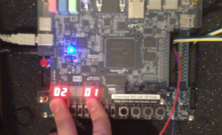

_Last edited: 2021-02-22_

ECE241: Digital Systems is a second-year class for Electrical and Computer Engineering Students at University of Toronto. This class teaches logic gates, simple computer architecture, and FPGA programming using Verilog. The course culminates in an FPGA design project done in pairs. Our project is available on [github](https://github.com/bill-bateman/SpaceWars/).

Below is a edited version  of our report for the course.



# Introduction

We wanted to make an 80's inspired video game that emulated the look and feel of games from that era, with two NES controllers as input. Our result is Space Wars, a Player-vs-Player space shooter where each player has to defend their respective planet from the opponent. Our focus was on making a game with balanced mechanics that would be legitimately fun to play, and not just a novelty.

# The Design

Our core gameplay centers around the attack and defense projectiles each ship can fire. The attack projectiles do damage to the planets and are fairly large and slow moving. The defense projectiles on the other hand are significantly smaller (3px tall as opposed to 9px) and move a lot faster. These projectiles are used to destroy enemy attack projectiles before they hit your planet. You can only have one defense projectile out at any given time, and the attack projectiles have a cooldown timer each time you fire.

We designed our project so it would split well into multiple modules where all the logic would be performed. Due to this, our top ­level module, simply named SpaceWars has very little logic, and mostly instantiates other modules and connects wires between them and inputs/outputs. Please see Fig. 2 in the Appendix for our block diagram of the top ­level module.

The modules instantiated are: alternate clock signals, handlers for the NES controllers, ship and projectile control, planet status, the gamestate finite state machine (FSM), the drawing FSM and datapath, hex decoders for various outputs, and the VGA adapter.

## Clock Signals

We made a three modules for dividing the 50 MHz clock into slower rates (60Hz, 30Hz, and ~166.7kHz for a 6​μ​s clock). The 30Hz clock is used to update the gamestate (move the ships and projectiles, collision detection, etc.). The 60Hz and 166.7kHz are used for getting the input from the NES controllers.

## NES Controllers

We used a finite state machine to interface with the controllers the same way an NES console would. We used the 60Hz clock to send a signal to the controller’s ‘latch’ wire, which causes the controller to store the states of the buttons (i.e. pressed or unpressed). We then use the 166.7kHz clock to send eight 6​μ​s high pulses to the controller’s ‘pulse’ wire. At the negative edge of each pulse, the data wire is guaranteed to hold the status of a button as its value. The order of the buttons is constant (A, B, Select, Start, Up, Down, Left, Right), and the logic is inverted (i.e. ground means pressed). T​he values from the data wire are then stored in each buttons’ respective register, and used as inputs in our main module.


As a reference, we used [this site by Tresi Arvizo](https://tresi.github.io/nes/). In case the link ends up dead, I will copy the relevant parts here.

>```
>           +----> Power  (white)
>           |
> 5 +---------+  7
>   | x  x  o   \
>   | o  o  o  o |
> 4 +------------+ 1
>     |  |  |  |
>     |  |  |  +-> Ground (brown)
>     |  |  +----> Pulse  (red)
>     |  +-------> Latch  (orange)
>     +----------> Data   (yellow)
>
>       NES Controller Pins
>```
>
> Of the seven wires, two of them literally go nowhere; they are not connected to the circuit board or anything else. Of the remaining five, one goes to +5V and the other goes to ground, thus leaving three interesting wires. Since 2³ = 8, one might assume that the eight controller buttons translate to these three output lines; this is not the case, especially since the NES games can register when more than one button is being simultaneously held down. 
>
>
>
>The NES uses a serialized polling mechanism to query the state of the buttons. Every 60 Hz, the NES sends a 12us high signal to the Latch pin, telling the controller to latch the state of of all buttons internally. Six microseconds later, the NES sends 8 high pulses on the Pulse pin, 12us per full cycle, 50% duty cycle. 
>
> After the initial wide pulse on the Latch pin, Data goes high until the eighth pulse passes, at which point it drops low again. For each pulse on the Pulse pin, Data will assert ground if the button corresponding to that pulse was pressed. (The button states on Data are thus negative true.) The button order is always the same: A, B, Select, Start, Up, Down, Left, Right. 

Note that for our project, we used 2 knock-off NES controllers purchased from a video game retail store (since we did not have access to the genuine article). While the pinout and protocol ended up being exactly the same, the _colour_ of the wires were different.

## Ship and Projectile Module

The ship_control module contains all the logic for the ships and both types of projectiles, including movement and collision detection.

Inputs to this module include the clocks, the current draw and game state, the NES controller inputs, the enemy defense projectile information, whether the defense projectile of this ship hitan enemy attack projectile, and which ship this module defines.

Outputs are the position of the ship and all projectiles, whether the projectiles exist or not, if the enemy defense projectile hit an attack projectile, if an attack projectile hit the enemy planet, and which frame of animation to draw.

All the information for the ships is updated on a 30 Hz clock (this occurs via the draw FSM). The ship moves based on the NES controller input.

For projectiles, there are enough wires to allow four attack projectiles (‘rockets’) for each ship, but only one defense projectile (‘bullets’). Generation of rockets is inhibited by a cooldown counter (which depends on the current game mode). The bullet has no cooldown, but the restriction is that there can only be one bullet (per ship) at a time.

Each attack projectile (if it exists) is checked against the enemy defense projectile for collision, and then against collision with the enemy planet. If collision is detected, the appropriate output wire is set to high.

## Planet Status

We used a counter to control the states of the two planets. Each of the planets could either have its shield, no longer have its shield, be damaged, or be dead. A planet’s status will worsen if it receives a signal from the corresponding ship module indicating that an attack projectile has hit the planet. In regular gameplay, it only takes one hit for the planet to progress to the next state,but if ‘War’ mode is on (SW[1]==1 - set using the FPGA development board), then it takes 10 hits to take down the shield, and 5 hits to progress between each of the remaining states. If a planet reaches the Dead state it will send a signal to the gamestate FSM indicating that the other planet has won.

## Gamestate FSM

There are four possible game states we alternate between depending on the planet states and inputs from the user. The initial state is the menu. In this state, we simply wait for a player to press start, then transition into the play state. We are most often in this state, and it is the only state where everything is drawn and movement is simulated. After one of the players has won, game state progresses to the appropriate game over state (depending on the victor) in which we draw the game over screen, and reset the ship and planet registers. We then wait for the user to press start, then return to the play state.

## Drawing (FSM and Datapath)

We use an FSM to control what is being drawn to the VGA module. In the play state, we draw the background, the planets, the ships and the projectiles/explosions (if they exist) in that order, each in their own state. We do this by reading from RAM blocks that are initialized using .miffiles of the appropriate image. We then send the VGA module the appropriate colour and pixel position to draw to the screen. For things that have multiple frames of animation (i.e. planets, ships, and explosions), we just load from a different RAM block depending on the state of a wire or counter.

The frame is redrawn to the vga module when the module is finished outputting the frame to the monitor. At the end of drawing, the FSM either goes to the WAIT state, or to the UPDATE_GAME_STATE state where object positions and states are allowed to change.

## Hex Decoders

We use the same hex decoder that we had been using in our labs to display the number of wins each planet has accumulated. If we are in ‘Earth Defense Mode’ (controlled by SW[0] on the FPGA board), the number of projectiles shot down is displayed instead. Both of these scores can be reset by pressing KEY0, or by switching to the other mode.

## VGA Adapter

The VGA adapter we use to draw to the monitor is a modified version of the code given to us for lab 7. The inputs and outputs are mostly the same. However, we added a wire to signal when the module is finished drawing a frame to the monitor, which is used to control the draw FSM.

The first modification we made was to allow support for 640x480 resolution, by increasing the size of the requisite wires. The on­chip memory was too small for this higher resolution, but our changes remain. 

We also increased the number of colours we could have. This required us to modify thebmp2mif.exe program to output 9­bit colours (3­bit colour channels).

Finally, we added a double frame buffer to reduce flickering on the screen. This required small changes to vga_adapter.v and vga_controller.v.

# Report on Success

We felt that our project was largely successful, as we fulfilled our major goals. The game runs smoothly, with no flickering and good looking graphics and animations. The controls work well and are responsive. The game is fun and competitive, while still being fairly easy to pick up, which speaks of good game design. Overall, we fulfilled everything we wanted to do, except perhaps the addition of sound, which simply would have taken too much time. This being said, we did run into two major hurdles.

Our first major hurdle was getting the NES controllers to function properly. Our initial attempt failed. We had assumed that the wiring would be the same as the official NES controllers, but the colours of the wires were different. What likely happened is we connected power to the wrong terminal, rendering the controller unusable. In order to get something working, we manually interfaced with that controller, rewiring the internal hardware to allow us input from the four buttons we needed. However, this was a poor fix and did not work well.

Our second attempt was much more successful. We broke apart the connector which wasoriginally attached to the controller, and compared the incoming wires with a pinout we found online. We were then able to figure out which wire served what purpose, and we successfully wired up the controller.

Our second major hurdle wasthe small size of the on-­chip memory. We rely on this memory for all the graphics in our game, as it is easy to access. Initially, we assumed we would have more than enough space for everything we wanted. However, when we attempted to create a double-frame buffer in 640x480 resolution with 3­bit colour channels, Quartus failed to compile due to lack of on­-chip memory.

We looked into using the external SDRAM, which would have given 8MB of memory, asopposed to the on­chip 512kB. However, it would have taken a lot of time and effort. We decided that it would not add enough to our project to warrant the amount of time it would take, and instead switched back to the lower resolution (320x240), while keeping 3­bit colourchannels. In the end, our game still looks good.

Aside from these issues, the project generally went without a hitch. We even met a lot of ourstretch goals, such as explosion animations and additional game modes.