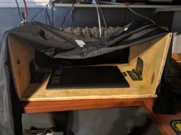
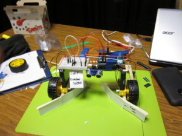
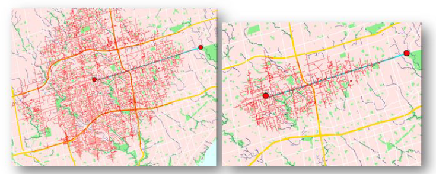

# Employment

---

## **_BlueCat Networks_**
_Software Engineer II (May 2021 - Current. Remote, Canada)_

_Software Engineer (June 2019 - April 2021. Toronto, ON / Remote, Canada)_

_Software Developer Co-op (Jan 2018 - Aug 2018. Toronto, ON)_

- Member of a small research team of a networking company specializing in DDI (DNS, DHCP, IPAM).
  - Specific focus on the company's DNS proxy and data.
  - Free to work in a breadth of areas to prototype and explore new directions.
  - At times called upon for development work or time-boxed investigations.
- Ongoing effort to increase user impact by adding analytic capabilities to the data platform.
  - Leading investigation into detecting malicious DGAs (Domain Generation Algorithms). 
    - By leveraging Machine Learning, improved detection from roughly 25% to 95%.
    - Wrote Airflow job to generate reports.
    - See related [blog post](https://bluecatnetworks.com/blog/among-cyber-attack-techniques-what-is-a-dga/) written by my team lead.
  - Also researching other potentially malicious activity, including typosquat queries, DNS tunneling, fast fluxing, and beaconing. 
  - Investigated network data represented in a variety of ways (e.g. graph database).
- Contributed to investigations around the existing data pipeline, which was based around ElasticSearch.
  - Performed scale testing on an ELK (ElasticSearch - Logstash - Kibana) deployment.
  - Prototyped custom cloud-based index and data store.
- Part of a larger initiative to replace ElasticSearch Service, greatly reducing cost and increasing analytics capabilities.
  - Data is stored in AWS S3, and queried using Trino.
  - Full stack is: Terraform, Kubernetes, Helm, Pulsar, Flink, S3, Trino, Airflow, Prometheus, Grafana.
- Prototyped a highly customizable DNS proxy.
  - Based on a custom DSL that compiles into Rust or WebAssembly. 
  - Informed the next version of DNS proxy, which was rewritten from Java to Rust, and uses a plugin-based architecture.
- Assisted another team with learning Rust.
- Contributed to the open source project Vector.
  - Added support for [http](https://github.com/timberio/vector/pull/1650) and [dnstap](https://github.com/timberio/vector/pull/6681/commits) sources, as well as a [couple smaller PRs](https://github.com/timberio/vector/pulls?q=is%3Apr+is%3Aclosed+author%3Abill-bateman+).
- Conferences attended:
  - AWS re:Invent 2019 to increase my knowledge of the AWS cloud.
  - MLOps 2021 to learn about operationalizing Machine Learning.

**Languages / Tools:**
Rust, Python, Java, Flink, Vector, Tensorflow/Keras, Trino, Kubernetes, AWS (Lambda, Firehose, S3, Kinesis, ElasticSearch Service)

--------

## **_Ranch Systems_**
_Summer Intern (May 2017 - Aug 2017. Novato, CA)_

- Integrated new sensors in various protocols including flow meters, VFD controllers, radios, and cameras.
- Prototyped OCR (Optical Character Recognition) software to automate reading of flow meter displays.

**Languages / Tools:**
Company's Custom DSL (for sensor integration); C++, OpenCV, Google Tesseract (for OCR)

---

## **_University of Toronto_**
### **Summer Research Fellowship**

_Summer Research Fellowship (May 2016 - Aug 2016. Toronto, ON)_

- Funded through NSERC USRA (Undergraduate Student Research Award) to work under Prof. Alberto Leon-Garcia.
- Developed application for detection of anomalous behaviours in networks of VMs based on a Master's Thesis from Prof. Leon-Garcia's research group.
- Worked with a team of summer students to develop a IoT application that monitored crowd movement based on WiFi traffic.

**Languages / Tools:**
Scala, Apache Spark (for anomaly detection); Python, Raspberry Pi, Onion board, MongoDB (for IoT application)

---

## **_Reinke Manufacturing_**
_Computer Engineering Intern (May 2015 - Aug 2015. Deshler, NE)_

_Engineering Assistant - Part Time (Aug 2013 - Aug 2014. Deshler, NE)_

- Worked with an Embedded Software Engineer to develop improved on-board software for large irrigation equipment.
- Interfaced with sensors, sprinklers, and GPS.
- Improved functionality and usability of software to control large irrigation equipment via radio
- Owned features from customer interviews in the field to development.

**Languages / Tools:**
C++, Qt/QML, Visual Basic

---

# Education

## **_University of Toronto_**

_Sept 2014 - May 2019_

_B.ASc. Computer Engineering with High Honours_

- Graduated with 4.0 GPA
- Awarded Adel S. Sedra Gold Medal for highest cumulative academic standing in Computer Engineering
- Awarded W. S. Wilson Medal for highest weighted average in 4th year Computer Engineering
- Certificate in Music Technology

---

# Projects

Please refer to my [posts](/posts/) for additional projects, especially [computers](/posts/?category=computers) and [games](/posts/?category=games).

## Capstone
_Sept 2018 - Apr 2019_
- Final year undergraduate design project with 3 other students, lasting from September 2018 to April 2019.
- Worked with Professor Mireille Broucke to create an inexpensive apparatus for performing simple and configurable experiments on the human visuomotor system.
- Succesfully produced similar experimental results as found in literature.
- Used a drawing table for input and OpenGL and C++ for graphical output.

## Ontario Engineering Competition
_2017 Senior Design Hackathon Participant_
- In a team of 3, placed first in the Senior Design category at University of Toronto Engineering Kompetition in 2017.
- Further represented UofT at OEC 2017 in Ottawa.
- Designed, built, and programmed a simple device to clean up "snow and rocks" (ping pong balls and rocks) from a short track, travel in a straight line, and stop from running into obstacles.

## Mapping Software
_Jan 2016 - Apr 2016_
- In a team of 3, made an offline mapping tool using OpenStreetMap data in C++.
- Visualized streets, points of interest, and terrain. Route planning based on A* algorithm.
- Researched and implemented various heuristics for a modified Travelling Salesman Problem. Ranked 2nd out of over 100 teams in terms of TSP solution.
